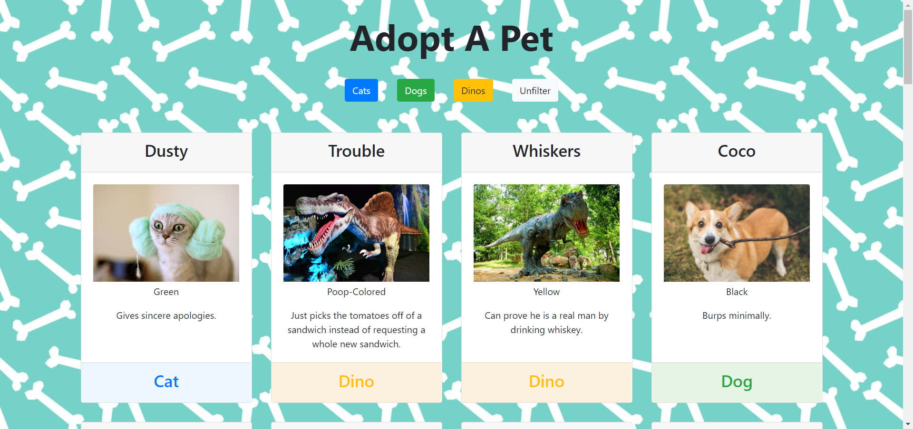
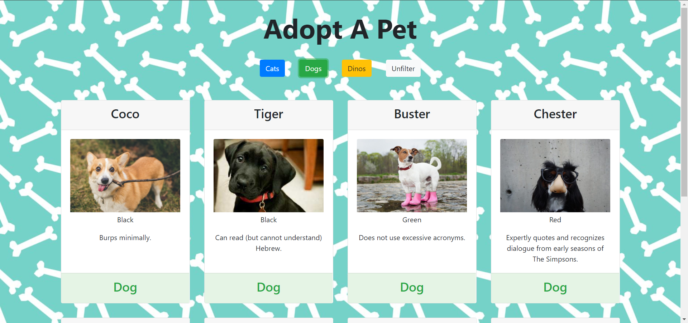

# Pet Adoption Site

## Description
In this project, the task was to build a pet adoption website using ES6 Modules. The user should have the ability to filter by pet type.

## Screenshots




## How to run this project
* Use npm to install http-server in your terminal:
```sh
npm install -g http-server
```
* Run the server in your terminal
```sh
hs -p 9999
```
* Open chrome and navigate to:
```
localhost:9999
```
## Contributors
[Maggie Leavell](https://github.com/mjleavell)

